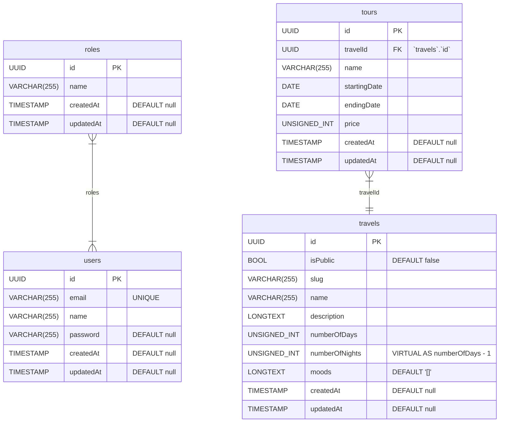

# :floppy_disk: Database schema

What follows is the main database schema, represented as ER diagram following
[Mermaid syntax](https://mermaid.js.org/syntax/entityRelationshipDiagram.html). All updates to the main schema will be
tracked in this file.

## The diagram

